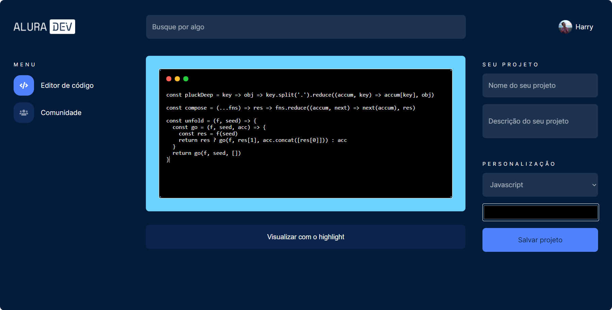

# AluraDev
Projeto feito através da participação no Alura Challenge
____
## Primeira semana - construção do Frontend da tela principal

## Tecnologias
- [React](https://pt-br.reactjs.org/) 
- [HTML](https://developer.mozilla.org/pt-BR/docs/Web/HTML/HTML5)
- [CSS](https://developer.mozilla.org/pt-BR/docs/Archive/CSS3)

## Ferramentas
- [Visual Studio Code](https://code.visualstudio.com/) - IDE de desenvolvimento geral
- [Trello](https://trello.com/pt-BR) - repositório para criação e compartilhamento de quadro com cards do backlog através da metodologia Kanban
- [Figma](https://www.figma.com/) - repositório para criação e compartilhamento de designs de interface

🚧🚧🚧 Under construction...

